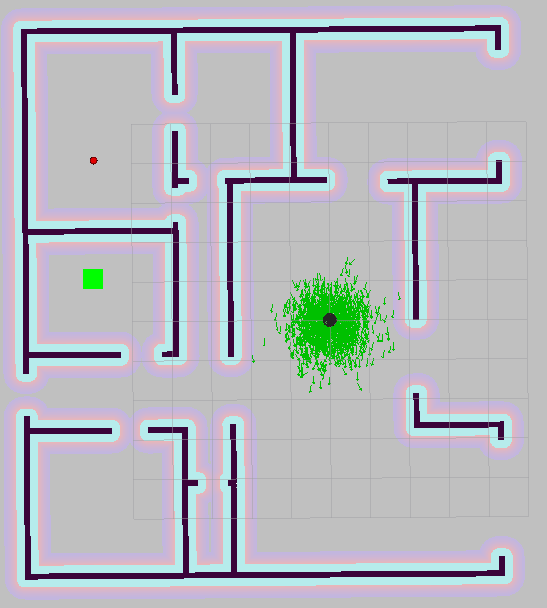

# HOME service ROBOT

A full home service robot capable of navigating to pick up and deliver virtual objects to a destination (drop-off) location:
1. The ***add_markers*** node publishes mission(s) as pick_object_mission.msg custom message(s) to a pick object mission topic "pick_object_missions" and subscribes to odometry to keep track of the robot pose.
2. The ***pick_object*** node subscribes to the missions topic "pick_object_missions" and moves the robot to the goals defined within the mission (pauses 5s for pick-up).

## Setup environment, clone/ install dependencies

Installing (map creation) dependencies: `sudo apt-get install libignition-math2-dev protobuf-compiler`

Run `./src/scripts/get_ros_packages.sh https`

## Compile/Run home_service script

Run `catkin_make` to build the home service project

Run `./src/scripts/home_service.sh` to run the pick-up/mission

## The robot executing pick object mission

### Map creation from Gazebo world using PGM creator (if needed: world modified/updated)

Cloning pgm_map_creator package: `git clone https://github.com/udacity/pgm_map_creator.git ./src/pgm_map_creator` (already done within the )

Copy gazebo world: `cp <GAZEBO WORLD FILE> src/pgm_map_creator/world/`

Insert the map creator plugin : insert `<plugin filename="libcollision_map_creator.so" name="collision_map_creator"/>` before `</world>`

Create the pgm map: `gzserver src/pgm_map_creator/world/<GAZEBO WORLD FILE>`

launch the request_publisher node (in another terminal) : `roslaunch pgm_map_creator request_publisher.launch`
